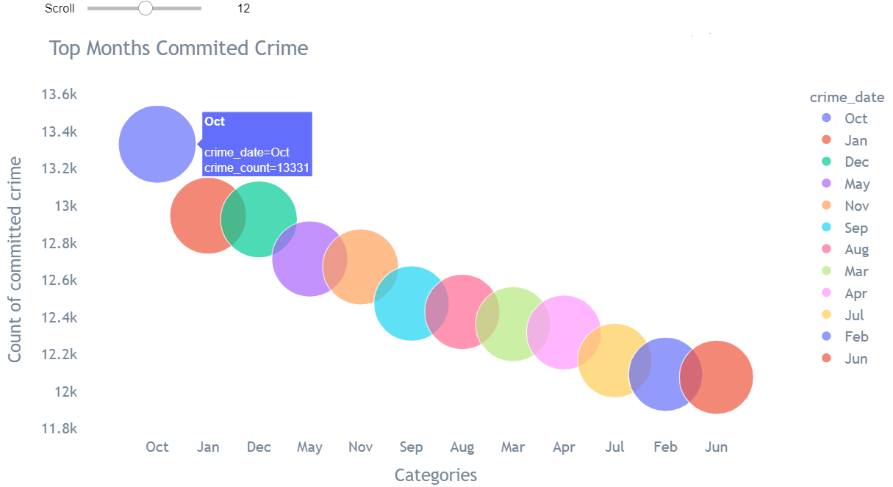
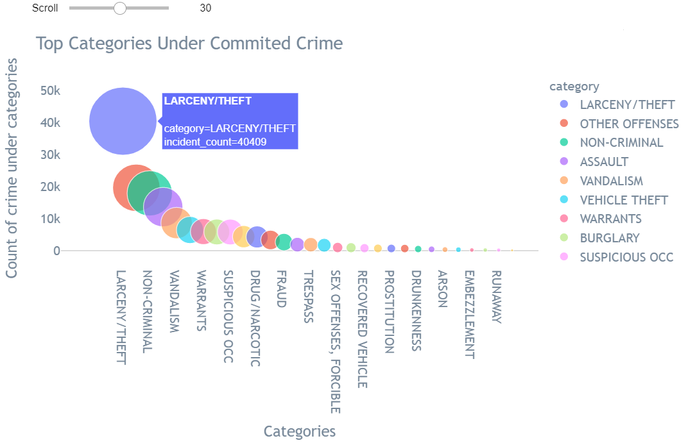
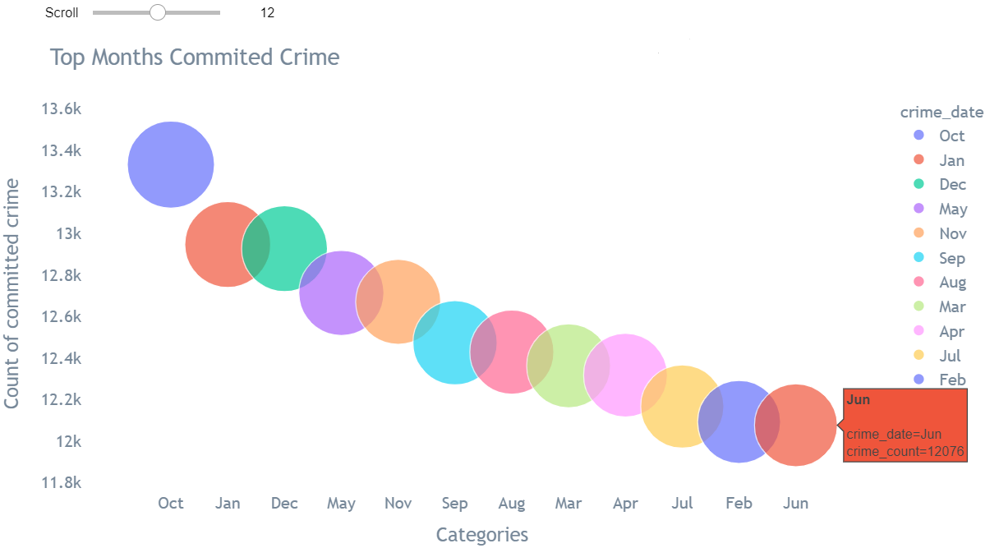
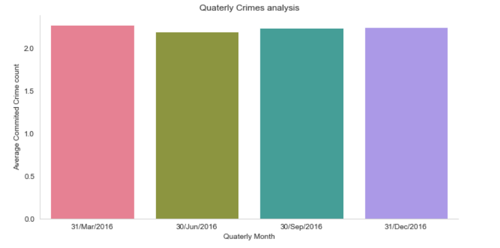
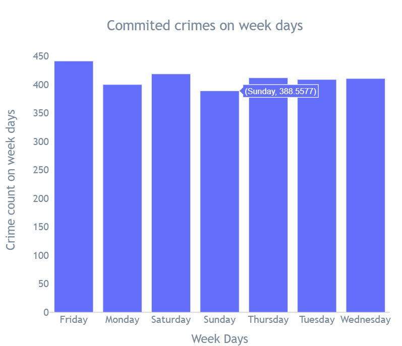
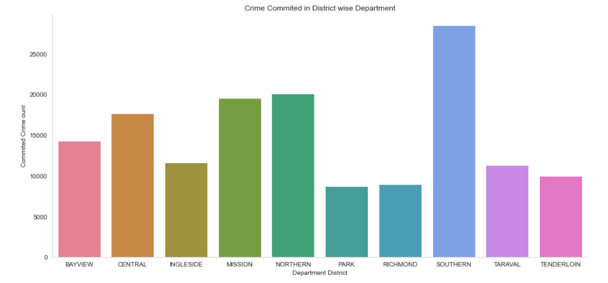
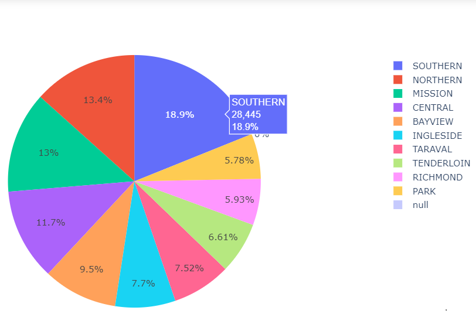

# San-Francisco-crime-analysis

# About Dataset- San Francisco registered committed offences of crime record data of the year 2016 
The dataset can be downloaded from - https://bit.ly/2EfvRaG
1. The Data Description is as follows -
2. incident_id - A number assigned to each incident reported.
3. category - Category of the incident reported
4. crime_description - Description explaining the nature of the crime.
5. crime_date - date on which the crime was reported.
6. department_district - district in which the police department is located.
7. resolution - Details of resolution (if any).
8. address - Address where the crime occurred.
9. department_id - police department id.
10. location - lat-long location where the crime was committed.

# Problem statement- Imagine you are working as a Data Analyst for a Police Department.
1. The Police Captain would like to perform a detailed analysis of the crime committed in your jurisdiction in the year 2016 (Yes !! the data is old since the police department is    still catching up with digitalization).
2. The idea is to extract actionable insights from the analysis for improving the overall safety of the city by learning from past experiences.
3. The problem statement is open-ended by design. The captain is not aware of the pre-existing patterns and trends that are to be uncovered through the dataset. He is relying on      you to unearth interesting insights. So be creative. Thesafety of your city depends on you !!!

# Requirements

