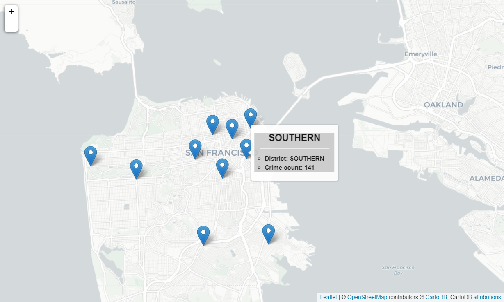

# San-Francisco-crime-analysis

 The dataset can be downloaded from- https://bit.ly/2EfvRaG

# Dataset- San Francisco registered committed offences of crime record data of the year 2016

1.  The Data Description is as follows -
2.  incident_id - A number assigned to each incident reported.
3.  category - Category of the incident reported
4.  crime_description - Description explaining the nature of the crime.
5.  crime_date - date on which the crime was reported.
6.  department_district - district in which the police department is located.
7.  resolution - Details of resolution (if any).
8.  address - Address where the crime occurred.
9.  department_id - police department id.
10. location - lat-long location where the crime was committed.

# Problem statement- Imagine you are working as a Data Analyst for a Police Department.
1. The Police Captain would like to perform a detailed analysis of the crime committed in your jurisdiction in the year 2016 (Yes !! the data is old since the police department is    still catching up with digitalization).
2. The idea is to extract actionable insights from the analysis for improving the overall safety of the city by learning from past experiences.
3. The problem statement is open-ended by design. The captain is not aware of the pre-existing patterns and trends that are to be uncovered through the dataset. He is relying on      you to unearth interesting insights. So be creative. Thesafety of your city depends on you !!!

# Insights of data

1. Which district department registered more/less crime ?
2. Which category having more crime registered ?
3. Weekly, Monthly, Quarterly crime patterns ?
4. Type of offences committed in each district ?
5. Which department is more efficient to resolve problem ?
6. Mapping of latitude and longitude of locations ?
7. Top 10 district where maximum crime committed ?

# Conlusion
As most crimes committed are of Larceny/Theft. We see an uptick in crime with the need/want of consumption. This is also seen through days on which the crimes are committed.
i.e. Fridays and start of festivities in October. So by increasing police size and police patrols around festivities we can reduce number of crimes.

# Requirements
1. pip install pandas
2. pip install plotly
3. pip install ipywidgets
4. pip install folium

